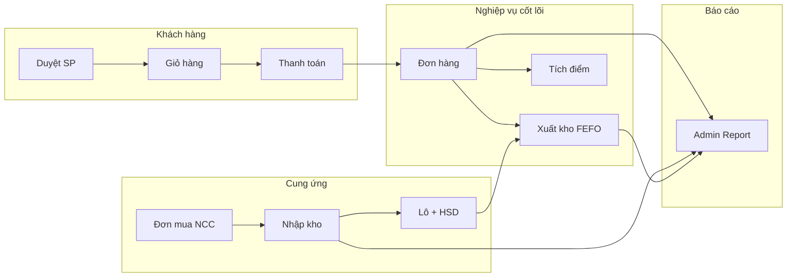

# NGHIỆP VỤ & CHỨC NĂNG DOANH NGHIỆP — NHÀ THUỐC LONG CHÂU

> **Mục đích**: Tài liệu tập trung toàn bộ nghiệp vụ kinh doanh, quy trình, vai trò, chỉ số báo cáo — phục vụ viết báo cáo, bảng phân tích nghiệp vụ, use case, BPMN, hoặc đưa context cho AI.
> **Cập nhật lần cuối**: 2026-06-17
> **Liên quan**: [PROJECT_CONTEXT.md](./PROJECT_CONTEXT.md) · [DATABASE_CONTEXT.md](./DATABASE_CONTEXT.md)

---

## 1. TỔNG QUAN DOANH NGHIỆP

| Thuộc tính | Giá trị |
|---|---|
| **Tên hệ thống** | Nhà Thuốc Long Châu — Bán thuốc trực tuyến |
| **Mô hình** | B2C e-commerce dược phẩm |
| **Đối tượng** | Khách hàng cá nhân mua thuốc OTC và thuốc kê đơn |
| **Kênh bán** | Website ASP.NET Core MVC |
| **Thanh toán** | PayOS (QR/chuyển khoản) + COD (thanh toán khi nhận) |
| **Vận hành** | Admin quản trị + nhân viên kho + CSKH |

### Đặc thù ngành dược (business rules)

- Sản phẩm có thể **yêu cầu kê đơn** (`RequiresPrescription`) — ghi chú đơn `PrescriptionNote`
- Quản lý **lô hàng & hạn sử dụng (HSD)** — xuất kho theo **FEFO** (First Expiry, First Out)
- Cảnh báo lô **hết hạn / sắp hết hạn** trong báo cáo admin
- Thông tin dược: thành phần, liều dùng, chống chỉ định, số đăng ký BYT

---

## 2. CÁC BÊN LIÊN QUAN (ACTORS)

```
                    ┌─────────────────┐
                    │  Khách hàng     │
                    │  (Customer)     │
                    └────────┬────────┘
                             │ Mua hàng, đánh giá, chat, loyalty
                             ▼
┌──────────────┐    ┌─────────────────┐    ┌──────────────┐
│ Nhà cung cấp │───►│  Long Châu      │───►│  Đơn vị VC   │
│  (Supplier)  │    │  (Hệ thống)     │    │ GHN/GHTK/... │
└──────────────┘    └────────┬────────┘    └──────────────┘
                             │
              ┌──────────────┼──────────────┐
              ▼              ▼              ▼
        ┌──────────┐  ┌────────────┐  ┌─────────────┐
        │  Admin   │  │ NV Kho     │  │ CSKH        │
        └──────────┘  └────────────┘  └─────────────┘
```

| Actor | Vai trò hệ thống | Landing URL sau đăng nhập |
|---|---|---|
| **Khách hàng** | Mua SP, giỏ hàng, thanh toán, profile, loyalty | `/` |
| **Admin** | Toàn quyền quản trị | `/admin` |
| **WarehouseStaff** | Kho, nhập hàng, đơn mua NCC | `/AdminInventory?hub=1` |
| **CustomerSupport** | Chat hỗ trợ khách | `/admin/chat` |

### Tài khoản demo (seed)

| Email | Mật khẩu | Vai trò |
|---|---|---|
| admin@gmail.com | Admin123. | Admin |
| warehouse@longchau.local | Kho123456. | WarehouseStaff |
| support@longchau.local | Support123. | CustomerSupport |

---

## 3. PHÂN HỆ CHỨC NĂNG

### 3.1 Phía khách hàng (Storefront)

| Module | Controller / Route | Chức năng |
|---|---|---|
| Trang chủ | `HomeController` | Banner, SP nổi bật, gợi ý |
| Danh mục | `CategoriesController` `/Categories` | Duyệt SP theo category 3 cấp |
| Sản phẩm | `ProductController` `/Products` | Chi tiết SP, review, filter |
| Giỏ hàng | `CartController` | Thêm/sửa/xóa, áp voucher, checkout |
| Thanh toán | `PayOSController` | PayOS link + COD |
| Tài khoản | `AuthController` `/Auth` | Đăng nhập/ký, profile, quên MK |
| Loyalty API | `LoyaltyController` `/api/loyalty` | Xem điểm, đổi quà |
| Chat | `ChatApiController` `/api/chat` | Chat real-time với CSKH |
| AI Bot | `AiBotController` `/api/aibot` | Chatbot Gemini (dev) |

### 3.2 Phía quản trị (Admin)

| Module | Controller / Route | Role | Chức năng |
|---|---|---|---|
| Dashboard | `AdminHomeController` `/admin` | Admin | Tổng quan |
| Sản phẩm | `AdminProductController` | Admin | CRUD, import Excel |
| Danh mục | `AdminCategoryController` | Admin | CRUD category 3 cấp |
| Đơn hàng | `AdminOrderController` | Admin, Kho, CSKH | Quản lý trạng thái đơn |
| Banner | `AdminBannerController` `/AdminBanner` | Admin | CRUD banner marketing |
| Voucher | (trong Admin) | Admin | CRUD voucher, xem redemption |
| User | `AdminUserController` `/AdminUser` | Admin | Quản lý KH, khóa, export |
| Chat | `AdminChatController` | Admin, CSKH | Hỗ trợ khách real-time |
| Báo cáo | `AdminReportController` `/AdminReport` | Admin | KPI, export CSV |
| Kho | `AdminInventoryController` | Admin, Kho | Tồn kho, nhập/xuất, batch |
| Mua hàng NCC | `AdminPurchaseController` `/AdminPurchase` | Admin, Kho | PO, nhập kho, đề xuất nhập |
| NCC | `AdminSupplierController` `/AdminSupplier` | Admin, Kho | CRUD nhà cung cấp |
| Loyalty | `AdminLoyaltyController` `/AdminLoyalty` | Admin | Quản lý quà đổi điểm |
| Nhân viên | `AdminStaffController` | Admin | CRUD staff + role |

---

## 4. QUY TRÌNH BÁN HÀNG (ORDER-TO-CASH)

### 4.1 Luồng tổng quát

```
Khách duyệt SP → Thêm giỏ (Cart DB) → Áp voucher → Checkout
    → Tạo Order
    → [PayOS] Chờ thanh toán → Webhook/Return → Chờ xác nhận
    → [COD] Chờ xác nhận ngay
    → Admin xác nhận → Xuất kho (FEFO) → Đóng gói → Giao hàng → Đã giao
    → Tích điểm loyalty + cập nhật hạng
```

### 4.2 Máy trạng thái đơn hàng

```
Chờ thanh toán ──► Đã xác nhận ──► Đang đóng gói ──► Đang giao ──► Đã giao
       │                  │                │               │
       └──────────────────┴────────────────┴───────────────┴──► Đã hủy

Chờ xác nhận ──► Đã xác nhận ──► ... (nhánh COD / sau PayOS thành công)
```

| Trạng thái | Ý nghĩa nghiệp vụ |
|---|---|
| Chờ thanh toán | Đơn PayOS chưa thanh toán |
| Chờ xác nhận | Đã thanh toán (PayOS) hoặc COD — chờ admin duyệt |
| Đã xác nhận | Admin duyệt — **trigger xuất kho** |
| Đang đóng gói | Kho đang chuẩn bị hàng |
| Đang giao | Đã tạo Shipment + mã vận đơn |
| Đã giao | Hoàn tất — tính doanh thu, tích điểm |
| Đã hủy | Terminal — hoàn tồn nếu đã xuất |

### 4.3 Quy tắc chuyển trạng thái

| Quy tắc | Chi tiết |
|---|---|
| Terminal states | `Đã giao`, `Đã hủy` — không chuyển tiếp |
| Khách hủy được | Chỉ khi `Chờ xác nhận` hoặc `Đã xác nhận` |
| Admin hủy | Mọi trạng thái chưa terminal |
| Xuất kho | Khi chuyển sang `Đã xác nhận` |
| Hoàn kho | Khi hủy đơn đã xuất (`Đã xác nhận` / `Đang đóng gói` / `Đang giao`) |
| Lịch sử | Mọi chuyển trạng thái ghi `OrderStatusHistory` |

**Service**: `OrderService.cs` — `ChangeStatusAsync`, `CancelByCustomerAsync`

### 4.4 Giỏ hàng

- Mỗi user **1 giỏ** (unique UserId trong DB)
- Lưu voucher đang áp dụng (`VoucherCode`, `VoucherDiscount`)
- Checkout: tạo Order + OrderItems, xóa/clear cart
- **Service**: `CartService.cs`

### 4.5 Thanh toán

#### PayOS (online)

```
CreatePaymentLink → Redirect checkoutUrl
    → Khách thanh toán QR/banking
    → Webhook POST + Return URL
    → Verify HMAC-SHA256 (ChecksumKey)
    → Idempotency qua PayOSWebhookEvent
    → Cập nhật Payment + Order status
```

| Thành phần | File |
|---|---|
| Controller | `PayOSController.cs` (~27KB) |
| Service | `PayOSService.cs`, `PayOSWebhookProcessor.cs` |
| Models | `PayOSModels.cs`, `PayOSWebhookEvent.cs` |

#### COD (Cash on Delivery)

- Không qua PayOS — Order tạo với trạng thái `Chờ xác nhận`
- PaymentMethod = `"COD"` trong báo cáo

#### Trạng thái thanh toán

| Trạng thái | Ý nghĩa |
|---|---|
| Chưa thanh toán | Chưa thanh toán |
| Pending | Đang xử lý PayOS |
| Đã thanh toán | Thành công |
| Thanh toán thất bại | PayOS fail |
| Đã hủy | Hủy giao dịch |

### 4.6 Vận chuyển

- Admin tạo **Shipment** khi chuyển đơn sang `Đang giao`
- Hãng: GHN, GHTK, Viettel Post, Khác
- Có link tracking tự động theo carrier (`ShippingCarriers.GetTrackingUrl`)
- Quan hệ 1-1: 1 Order ↔ 1 Shipment

### 4.7 Email thông báo

| Sự kiện | Service |
|---|---|
| Xác nhận đơn | `OrderEmailService.cs` |
| Thông báo trạng thái | `OrderNotificationService.cs` |
| Quên mật khẩu | `AuthController` + `IEmailSender` |

**Pattern**: Dev → `NullEmailSender`; Prod → `SmtpEmailSender` (Gmail SMTP)

---

## 5. QUY TRÌNH MUA HÀNG & KHO (PROCURE-TO-STOCK)

### 5.1 Luồng nhập hàng

```
Đề xuất nhập (tồn thấp) → Tạo PurchaseOrder (NCC)
    → Xác nhận PO → Nhận hàng (GoodsReceipt)
    → Tạo ProductBatch (lô + HSD)
    → InventoryTransaction (Import)
    → Cập nhật WarehouseStock + Product.StockQuantity
```

### 5.2 Trạng thái đơn mua (PurchaseOrder)

| Trạng thái | Ý nghĩa |
|---|---|
| Nháp | Mới tạo, chưa gửi NCC |
| Đã xác nhận | Đã đặt hàng với NCC |
| Nhận một phần | Đã nhập một phần SL |
| Đã nhận đủ | Hoàn tất nhập |
| Đã hủy | Hủy PO |

### 5.3 Xuất kho bán hàng (FEFO)

Khi đơn `Đã xác nhận`:

1. Chọn lô theo **HSD sớm nhất** (`ProductBatch`)
2. Ghi `InventoryTransaction (BatchSale)` — phục vụ tính COGS chính xác
3. Ghi `InventoryTransaction (Sale)` nếu cần (legacy/tổng)
4. Giảm `WarehouseStock`, `ProductBatch.QuantityOnHand`
5. Sync `Product.StockQuantity`

**Service**: `InventoryService.cs` (~27KB)

### 5.4 Hoàn kho (Return)

- Khi hủy đơn đã xuất kho
- `InventoryTransaction (Return)` — tăng tồn lại
- Không hoàn nếu đã có Return cho OrderId đó

### 5.5 Kiểm kê / Điều chỉnh

- Admin/Kho: `InventoryTransaction (Adjustment)`
- QuantityAfter < QuantityBefore → ghi nhận **write-off loss** trong báo cáo

### 5.6 Cảnh báo tồn kho

| Loại | Điều kiện |
|---|---|
| Tồn thấp | `StockQuantity > 0 AND StockQuantity <= MinStockLevel` (báo cáo dùng ngưỡng 10) |
| Hết hàng | `StockQuantity <= 0 AND IsActive` |
| Đề xuất nhập | `/AdminPurchase/Replenishment` — nhóm SP cần nhập theo NCC |

---

## 6. MARKETING & KHUYẾN MÃI

### 6.1 Banner

- Quản lý banner trang chủ / category
- Trường: Title, ImageUrl, LinkUrl, BannerType, SortOrder, IsActive
- **Controller**: `AdminBannerController`

### 6.2 Hệ thống Voucher

#### Loại voucher

| Loại | IsPublic | Cách dùng |
|---|---|---|
| **Public** | true | Mọi user nhập mã; giới hạn `MaxUsage` tổng |
| **Private** | false | User phải có bản ghi `UserVoucher` |

#### Quy tắc áp dụng

| Rule | Field |
|---|---|
| Giảm cố định | `DiscountAmount` (VNĐ) |
| Giảm % | `PercentValue` |
| Đơn tối thiểu | `MinOrderAmount` |
| Theo danh mục | `CategoryId` |
| Theo hạng | `RequiredRank` (Bạc/Vàng/Bạch kim) |
| Hết hạn | `ExpiryDate` |
| Giới hạn lượt | `MaxUsage`, `UsedCount` |

#### Luồng sử dụng

```
User nhập mã → Validate (VoucherHelper)
    → Áp vào Cart/Checkout
    → Tạo Order (lưu VoucherCode, VoucherDiscount)
    → Ghi VoucherRedemption (unique VoucherId+OrderId)
    → Cập nhật UserVoucher.IsUsed, Voucher.UsedCount
```

#### Hoàn voucher

- Khi hủy đơn: `VoucherRedemption.IsReverted = true`

#### Background job

- `MonthlyVoucherHostedService` (trong `VoucherHelper.cs`) — reset/phát voucher hàng tháng theo hạng

---

## 7. CHƯƠNG TRÌNH KHÁCH HÀNG THÂN THIẾT (LOYALTY)

### 7.1 Hạng thành viên

| Hạng | Ngưỡng chi tiêu 6 tháng |
|---|---|
| Bạc | ≥ 0đ |
| Vàng | ≥ 5.000.000đ |
| Bạch kim | ≥ 10.000.000đ |

- Tính từ `UserRankInfo.TotalSpent6Months`
- Reset định kỳ (field `LastRankReset`)
- **Service**: `UserRankService.cs` (~16KB)

### 7.2 Tích điểm

| Quy tắc | Giá trị |
|---|---|
| Tỷ lệ | **1 điểm / 1.000đ** giá trị đơn (sau giảm giá) |
| Áp dụng | Mọi hạng như nhau |
| Thời điểm | Khi đơn `Đã giao` |
| Ghi nhận | `LoyaltyPointTransaction (Earn)` |

### 7.3 Đổi quà

- Admin cấu hình `LoyaltyReward` (quà đổi điểm)
- Loại quà: voucher % hoặc voucher cố định
- User đổi → trừ điểm → tạo voucher private gán user
- **Service**: `LoyaltyService.cs`
- **API**: `LoyaltyController`

### 7.4 Seed quà mặc định

3 LoyaltyRewards: Voucher 30K, 5%, 100K

---

## 8. DỊCH VỤ HỖ TRỢ KHÁCH HÀNG

### 8.1 Chat real-time (SignalR)

```
Hub: /chathub
Group: chat_{customerUserId}
Admin join: JoinConversation(customerUserId)
Lưu DB: ChatMessages (SenderId, ReceiverId, Message, IsRead)
```

| Vai trò | Quyền |
|---|---|
| Khách | Gửi/nhận trong popup chat |
| CSKH / Admin | `/admin/chat` — danh sách hội thoại |

### 8.2 AI Chatbot (Gemini)

- Route: `/api/aibot`
- Chỉ dev (API key trong `appsettings.Development.json`)
- Popup: `_AiChatPopup.cshtml`

### 8.3 Đánh giá sản phẩm

- Khách đánh giá sau mua (`Review`: Rating 1–5, Comment)
- Hiển thị trên trang chi tiết SP

---

## 9. QUẢN LÝ DANH MỤC SẢN PHẨM

### 9.1 Cấu trúc category

- **3 cấp** tự tham chiếu (ParentCategoryId)
- Level: `"Level 1"`, `"Level 2"`, `"Level 3"`
- `IsFeature` — hiển thị nổi bật menu/navbar

### 9.2 Thông tin sản phẩm dược

| Nhóm | Trường |
|---|---|
| Định danh | Sku, Barcode, RegistrationNumber (BYT) |
| Giá | CostPrice (vốn), Price (bán) |
| Dược học | Ingredients, Dosage, Uses, Contraindications, TargetUsers |
| Kinh doanh | Brand, Origin, Package, IsFeature, IsActive |
| Kho | StockQuantity, MinStockLevel, RequiresPrescription |
| SEO | Slug |

### 9.3 Import Excel

- Admin import hàng loạt SP
- **Service**: `ProductExcelImportService.cs` (~15KB)

### 9.4 Gợi ý sản phẩm

- **Service**: `RecommendationService.cs` — gợi ý trên trang chủ/chi tiết

---

## 10. BÁO CÁO & CHỈ SỐ KINH DOANH (KPI)

**Module**: `AdminReportController` — route `/AdminReport`  
**View**: `Views/Admin/Report/Index.cshtml` (~36KB)  
**Export**: `/AdminReport/Export` — CSV

### 10.1 Kỳ báo cáo

| Period | Mô tả |
|---|---|
| today | Hôm nay |
| yesterday | Hôm qua |
| last7days | 7 ngày gần nhất |
| last30days | 30 ngày |
| thisMonth | Tháng này (default) |
| lastMonth | Tháng trước |
| thisYear | Năm nay |
| custom | startDate + endDate tùy chọn |

### 10.2 Chỉ số tài chính

| KPI | Công thức / Nguồn | Ý nghĩa |
|---|---|---|
| **Doanh thu (Revenue)** | SUM(Order.TotalAmount) WHERE Status = Đã giao | Doanh thu ghi nhận |
| **Giảm giá voucher** | SUM(Order.VoucherDiscount) | Chi phí khuyến mãi |
| **Giá vốn (COGS)** | BatchSale × UnitCost (FEFO) + fallback CostPrice | Giá vốn hàng bán |
| **Lợi nhuận gộp** | Revenue - COGS | Gross Profit |
| **Biên lợi nhuận gộp** | GrossProfit / Revenue × 100% | Gross Margin % |
| **Thu tiền (Cash Inflow)** | SUM(Payment.Amount) WHERE Paid | Tiền thực thu |
| **Chi mua hàng (Cash Outflow)** | SUM(GoodsReceiptLine.Qty × UnitCost) | Tiền trả NCC |
| **Dòng tiền ròng** | CashInflow - CashOutflow | Net Cash Flow |

**Fallback COGS**: Nếu không có BatchSale → `Product.CostPrice` hoặc `Price × 60%`

### 10.3 Chỉ số tồn kho

| KPI | Công thức | Ý nghĩa |
|---|---|---|
| **Giá trị tồn hiện tại** | SUM(Batch.QtyOnHand × UnitCost) | Current Stock Value |
| **Vòng quay tồn kho** | COGS / AvgStockValue | Turnover Ratio |
| **Số ngày tồn (DIO)** | DaysInPeriod / TurnoverRatio | Days Inventory Outstanding |
| **Thất thoát kiểm kê** | Adjustment giảm tồn × CostPrice | Write-off Loss |

### 10.4 Cảnh báo HSD (đặc thù dược)

| Mức | Điều kiện | Status code |
|---|---|---|
| Đã hết hạn | daysLeft < 0 | Expired |
| ≤ 30 ngày | daysLeft ≤ 30 | Near30 |
| ≤ 90 ngày | daysLeft ≤ 90 | Near90 |
| ≤ 180 ngày | daysLeft ≤ 180 | Near180 |

Báo cáo: số lô, SL, giá trị theo từng mức (`ExpiryWarningSummary`)

### 10.5 Báo cáo chi tiết

| Báo cáo | Nội dung |
|---|---|
| **SP bán chạy** | ProductName, Sku, QtySold, Revenue, COGS, Margin — sort theo Qty |
| **Phương thức TT** | COD vs PayOS — số đơn, tổng tiền |
| **Top KH chi tiêu** | Top 10 — Email, FullName, OrderCount, TotalSpent |
| **Biểu đồ xu hướng** | Revenue / COGS / Profit theo ngày (≤60 ngày) hoặc tháng |
| **Tồn thấp** | Top 10 SP StockQuantity ≤ 10 |
| **Hết hàng** | Count SP IsActive AND StockQuantity ≤ 0 |
| **Voucher tháng** | Count VoucherRedemption (không reverted) |
| **Đổi quà tháng** | Count LoyaltyPointTransaction Redeem |

### 10.6 Export CSV

Cột export gồm: Tổng doanh thu, COGS, Lợi nhuận gộp, Biên %, và bảng chi tiết SP (SKU, Qty, Revenue, COGS, Profit, Margin%)

---

## 11. BẢNG GỢI Ý CHO BÁO CÁO ĐỒ ÁN

### 11.1 Bảng mô tả Use Case (gợi ý)

| ID | Use Case | Actor | Mô tả ngắn |
|---|---|---|---|
| UC01 | Đăng ký / Đăng nhập | Khách | Tạo tài khoản, xác thực Identity |
| UC02 | Duyệt & tìm SP | Khách | Category, filter, chi tiết |
| UC03 | Quản lý giỏ hàng | Khách | CRUD cart, voucher |
| UC04 | Thanh toán PayOS | Khách | QR/banking online |
| UC05 | Thanh toán COD | Khách | Đặt hàng trả tiền khi nhận |
| UC06 | Theo dõi đơn hàng | Khách | Profile → lịch sử đơn |
| UC07 | Chat CSKH | Khách, CSKH | SignalR real-time |
| UC08 | Tích điểm / Đổi quà | Khách | Loyalty program |
| UC09 | Quản lý đơn hàng | Admin | Chuyển trạng thái, hủy |
| UC10 | Quản lý kho | NV Kho | Nhập/xuất, batch, HSD |
| UC11 | Đặt hàng NCC | Admin, Kho | PO → GoodsReceipt |
| UC12 | Báo cáo KPI | Admin | Doanh thu, COGS, tồn kho |
| UC13 | Quản lý voucher | Admin | CRUD chiến dịch KM |
| UC14 | Quản lý SP | Admin | CRUD, import Excel |

### 11.2 Bảng quy trình nghiệp vụ chính

| STT | Quy trình | Input | Output | Module liên quan |
|---|---|---|---|---|
| 1 | Bán hàng online | Giỏ hàng + TT | Order Delivered | Cart, PayOS, Order |
| 2 | Xuất kho FEFO | Order Confirmed | BatchSale transaction | Inventory |
| 3 | Nhập hàng NCC | PO + hàng về | Batch + tồn kho | Purchase, GoodsReceipt |
| 4 | Khuyến mãi voucher | Mã + đơn | Giảm giá + Redemption | Voucher |
| 5 | Loyalty | Đơn giao | Điểm + hạng | UserRank, Loyalty |
| 6 | Báo cáo tài chính | Orders Delivered | KPI dashboard | AdminReport |

### 11.3 Ma trận phân quyền (RBAC)

| Chức năng | Admin | WarehouseStaff | CustomerSupport | Customer |
|---|:---:|:---:|:---:|:---:|
| Dashboard admin | ✓ | | | |
| CRUD SP/Category/Banner | ✓ | | | |
| Quản lý đơn | ✓ | ✓ | ✓ | Own |
| Kho / PO / NCC | ✓ | ✓ | | |
| Báo cáo | ✓ | | | |
| Chat admin | ✓ | | ✓ | |
| Quản lý user/staff | ✓ | | | |
| Loyalty admin | ✓ | | | |
| Mua hàng | | | | ✓ |

---

## 12. TÍCH HỢP BÊN NGOÀI

| Dịch vụ | Mục đích | Endpoint / Config |
|---|---|---|
| **PayOS** | Thanh toán online | `api-merchant.payos.vn` — ClientId, ApiKey, ChecksumKey |
| **Gmail SMTP** | Email xác nhận | smtp.gmail.com:587 — EmailSettings |
| **Gemini AI** | Chatbot (dev) | Gemini.ApiKey — Development only |
| **GHN / GHTK / ViettelPost** | Tracking vận đơn | Link tracking từ mã vận đơn |

---

## 13. LUỒNG DỮ LIỆU TỔNG HỢP (DIAGRAM)



---

## 14. DỮ LIỆU MẪU NGHIỆP VỤ (SEED)

| Loại | Giá trị |
|---|---|
| NCC mặc định | Code `NCC-MAC-DINH` |
| Loyalty rewards | Voucher 30K, 5%, 100K |
| Roles | Admin, WarehouseStaff, CustomerSupport |

---

## 15. FILE CODE THAM CHIẾU NGHIỆP VỤ

| Nghiệp vụ | File chính |
|---|---|
| Đơn hàng | `Services/OrderService.cs` |
| Giỏ hàng | `Services/CartService.cs` |
| Kho hàng | `Services/InventoryService.cs` |
| Thanh toán | `Controllers/PayOSController.cs`, `Services/PayOSService.cs` |
| Voucher | `Services/VoucherHelper.cs` |
| Loyalty | `Services/LoyaltyService.cs`, `Services/UserRankService.cs` |
| Báo cáo | `Controllers/Admin/AdminReportController.cs` |
| Email đơn | `Services/OrderEmailService.cs` |
| Trạng thái đơn | `Models/OrderStatuses.cs` |
| Hạng thành viên | `Models/LoyaltyTiers.cs` |
| Phân quyền | `Models/StaffRoles.cs` |

---

## 16. CÁC BIỂU MẪU IN (PRINT TEMPLATES)

### 16.1 Tổng quan

Hệ thống hỗ trợ các biểu mẫu in phục vụ nghiệp vụ kho và báo cáo. Các biểu mẫu được thiết kế đồng nhất với **logo brand** và **header chuẩn** của Nhà Thuốc Long Châu.

**Logo brand**: `/images/default/header_logo_brand.svg`

### 16.2 Danh sách biểu mẫu in

| Biểu mẫu | Route | Màu chủ đạo | Nội dung |
|---|---|---|---|
| Phiếu nhập kho | `/AdminPurchase/PrintReceipt/{id}` | Xanh lá (`#059669`) | Chi tiết lô, HSD, SL nhập |
| Đơn đặt hàng NCC | `/AdminPurchase/Print/{id}` | Xanh dương (`#1250dc`) | Thông tin NCC, đơn đặt, lịch sử nhận hàng |
| Báo cáo tổng hợp | `/AdminReport/Print` | Navy/Xanh dương (`#1e3a5f`) | KPI tài chính, dòng tiền, tồn kho |

### 16.3 Cấu trúc header chuẩn

Mỗi biểu mẫu in gồm 3 phần header:

```
┌─────────────────────────────────────────────────────┐
│  [LOGO] Long Châu                    📞 1900 1234   │
├─────────────────────────────────────────────────────┤
│  Nhà Thuốc Long Châu                In lúc: xx:xx  │
│  Đ/C: 123 Đường ABC, Quận 1, TP.HCM                │
├─────────────────────────────────────────────────────┤
│  📄 Tên biểu mẫu              Mã: XXX-XXX         │
└─────────────────────────────────────────────────────┘
```

### 16.4 Chi tiết từng biểu mẫu

#### 16.4.1 Phiếu nhập kho (`AdminPurchase/PrintReceipt`)

**Route**: `GET /AdminPurchase/PrintReceipt/{id}`

**Thông tin hiển thị**:
- Mã phiếu nhập kho
- Nhà cung cấp (tên, mã)
- Kho nhận hàng
- Ngày nhập
- Danh sách sản phẩm: Tên, SKU, Lô, HSD, SL, Giá nhập, Thành tiền
- Tổng số lượng và giá trị
- Ghi chú (nếu có)

**Màu header**: Xanh lá (`--brand-primary: #059669`)

#### 16.4.2 Đơn đặt hàng NCC (`AdminPurchase/Print`)

**Route**: `GET /AdminPurchase/Print/{id}`

**Thông tin hiển thị**:
- Mã đơn đặt hàng
- Trạng thái đơn (badge màu theo trạng thái)
- Thông tin NCC: Tên, mã, MST, Điện thoại, Email, Địa chỉ
- Kho nhận hàng
- Ngày đặt, dự kiến nhận
- Danh sách sản phẩm: Tên, SKU, SL đặt, Đã nhận, Còn lại, Giá, Thành tiền
- Tổng giá trị
- Lịch sử nhận hàng (các đợt đã nhận với chi tiết lô)

**Màu header**: Xanh dương (`--brand-primary: #1250dc`)

#### 16.4.3 Báo cáo tổng hợp (`AdminReport/Print`)

**Route**: `GET /AdminReport/Print?period={period}&warehouseId={id}`

**Thông tin hiển thị**:
- Kỳ báo cáo (Hôm nay, 7 ngày, Tháng này, v.v.)
- Kho áp dụng

**Phần I - Tóm tắt chỉ số tài chính**:
- Doanh thu, COGS, Lợi nhuận gộp, Giảm giá Voucher
- Đơn hoàn thành, Tiền thu (Inflow), Tiền chi NCC (Outflow), Dòng tiền ròng

**Phần II - Tình trạng kho hàng**:
- Giá trị tồn kho hiện tại
- Chi phí kiểm kê (Write-off)

**Phần III - Bảng tổng hợp dòng tiền**:
- Tiền thu từ khách hàng
- Chi trả nhà cung cấp
- Chi phí Voucher
- Thất thoát kiểm kê
- Dòng tiền ròng

**Phần IV - Phân tích biên lợi nhuận**:
- Tổng doanh thu (100%)
- Giá vốn hàng bán (COGS)
- Lợi nhuận gộp
- Chi phí Voucher

**Phần V - Ghi chú**:
- Công thức tính các chỉ số

**Màu header**: Navy/Xanh dương (`--brand-primary: #1e3a5f`)

### 16.5 Tính năng in

- **Nút In**: Mỗi biểu mẫu có nút "In phiếu" / "In báo cáo"
- **CSS Print**: `@media print` ẩn các nút không cần thiết, bỏ shadow
- **Footer bar**: Thông tin thương hiệu + số trang

### 16.6 File biểu mẫu

| File | Mô tả |
|---|---|
| `Views/Admin/Purchase/PrintReceipt.cshtml` | Phiếu nhập kho |
| `Views/Admin/Purchase/Print.cshtml` | Đơn đặt hàng NCC |
| `Views/Admin/Report/Print.cshtml` | Báo cáo tổng hợp |
| `wwwroot/images/default/header_logo_brand.svg` | Logo brand dùng chung |

---

> **Cách dùng**: Khi viết báo cáo phân tích nghiệp vụ, bảng use case, quy trình, KPI — lấy từ file này. Chi tiết bảng/cột CSDL xem [DATABASE_CONTEXT.md](./DATABASE_CONTEXT.md).
