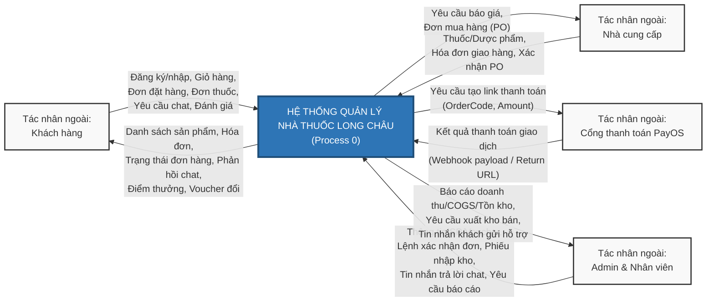
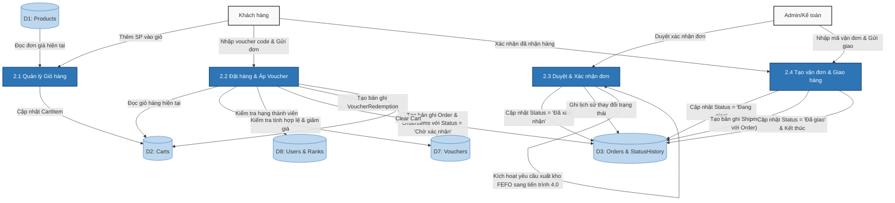
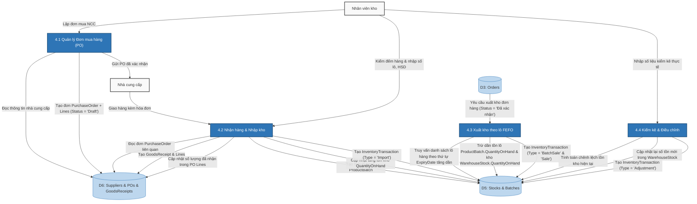

# BÁO CÁO 2 — PHÂN TÍCH THIẾT KẾ CƠ SỞ DỮ LIỆU DỰ ÁN NHÀ THUỐC LONG CHÂU

> **Môn học**: Các hệ quản trị cơ sở dữ liệu  
> **Đề tài**: Thiết kế & Triển khai Hệ thống Quản lý Chuỗi Nhà Thuốc Bán Lẻ Trực Tuyến Long Châu  
> **Nội dung thực hiện**: Phần 1 (Sơ đồ tổ chức nhân sự - Organization Chart) & Phần 5 (Bảng các Business rule)  
> **Ngày cập nhật**: 2026-06-17  
> **Tham chiếu nghiệp vụ & CSDL**: [BUSINESS_CONTEXT.md](../BUSINESS_CONTEXT.md) · [DATABASE_CONTEXT.md](../DATABASE_CONTEXT.md)

---

## 1. SƠ ĐỒ TỔ CHỨC NHÂN SỰ (ORGANIZATION CHART)

Để vận hành một chuỗi nhà thuốc bán lẻ quy mô lớn tích hợp thương mại điện tử như Long Châu, cơ cấu tổ chức nhân sự thực tế cần được phân định rõ ràng giữa các phòng ban chức năng tại Trụ sở chính (Head Office), các Kho trung tâm (Warehouse Hubs), bộ phận Vận hành trực tuyến (Digital Operations) và hệ thống cửa hàng. 

Dưới đây là sơ đồ tổ chức nhân sự chi tiết mô phỏng mô hình doanh nghiệp thực tế:

### 1.1 Sơ đồ phân cấp phòng ban (Organization Chart)

```mermaid
graph TD
    %% Định nghĩa Style
    classDef executive fill:#1f4e78,stroke:#113355,stroke-width:2px,color:#ffffff;
    classDef department fill:#2e75b6,stroke:#1f4e78,stroke-width:2px,color:#ffffff;
    classDef subdepartment fill:#bdd7ee,stroke:#2e75b6,stroke-width:1px,color:#000000;
    classDef role fill:#f2f2f2,stroke:#7f7f7f,stroke-width:1px,color:#333333;

    %% Các nút chính
    CEO["BAN GIÁM ĐỐC<br/>(Giám đốc điều hành - CEO)"]:::executive
    
    %% Các phòng ban
    IT["Phòng Công Nghệ Thông Tin<br/>(IT Department)"]:::department
    Sales["Phòng Kinh Doanh & Marketing<br/>(Sales & Marketing Dept)"]:::department
    Procure["Phòng Mua Hàng & Cung Ứng<br/>(Procurement Dept)"]:::department
    Warehouse["Phòng Kho & Hậu Cần<br/>(Warehouse & Logistics)"]:::department
    Finance["Phòng Kế Toán - Tài Chính<br/>(Finance & Accounting)"]:::department

    %% Mối liên kết phòng ban
    CEO --> IT
    CEO --> Sales
    CEO --> Procure
    CEO --> Warehouse
    CEO --> Finance

    %% Bộ phận con phòng IT
    IT_Sys["Bộ phận Quản trị Hệ thống<br/>(System Administration)"]:::subdepartment
    IT_Dev["Bộ phận Phát triển & Bảo trì Web"]:::subdepartment
    IT --> IT_Sys
    IT --> IT_Dev
    
    IT_Admin["System Administrator<br/>(Quản trị viên)"]:::role
    IT_Sys --> IT_Admin

    %% Bộ phận con phòng Sales & Marketing
    Sales_Mkt["Bộ phận Marketing & Campaign"]:::subdepartment
    Sales_CS["Bộ phận Chăm sóc Khách hàng<br/>(Customer Support)"]:::subdepartment
    Sales --> Sales_Mkt
    Sales --> Sales_CS
    
    Mkt_Staff["Nhân viên Marketing<br/>(Quản lý Voucher, Banner)"]:::role
    CS_Staff["Nhân viên hỗ trợ chat trực tuyến<br/>(CustomerSupport)"]:::role
    Sales_Mkt --> Mkt_Staff
    Sales_CS --> CS_Staff

    %% Bộ phận con phòng Mua Hàng
    Procure_Supp["Bộ phận Quản lý Nhà Cung Cấp"]:::subdepartment
    Procure_PO["Bộ phận Mua Hàng & Đơn đặt"]:::subdepartment
    Procure --> Procure_Supp
    Procure --> Procure_PO
    
    Procure_Staff["Nhân viên mua hàng<br/>(Procurement Officer)"]:::role
    Procure_PO --> Procure_Staff

    %% Bộ phận con phòng Kho
    WH_Stock["Bộ phận Thủ kho & Phân phối"]:::subdepartment
    WH_QC["Bộ phận Kiểm soát chất lượng & Lô/HSD"]:::subdepartment
    Warehouse --> WH_Stock
    Warehouse --> WH_QC
    
    WH_Staff["Nhân viên kho<br/>(WarehouseStaff)"]:::role
    QC_Staff["Kiểm soát viên lô hàng (FEFO)"]:::role
    WH_Stock --> WH_Staff
    WH_QC --> QC_Staff

    %% Bộ phận con phòng Kế toán
    Fin_Acc["Bộ phận Kế toán bán hàng & Kho"]:::subdepartment
    Fin_Audit["Bộ phận Thu ngân & Đối soát"]:::subdepartment
    Finance --> Fin_Acc
    Finance --> Fin_Audit
    
    Accountant["Kế toán viên<br/>(Đối soát PayOS/COD, COGS)"]:::role
    Fin_Acc --> Accountant
```

### 1.2 Vai trò chi tiết của từng bộ phận trong quy trình nghiệp vụ

1. **Ban Giám Đốc (Board of Directors - CEO)**:
   - Quyết định chiến lược phát triển kênh bán hàng trực tuyến và độ phủ của hệ thống.
   - Phê duyệt các chính sách kinh doanh lớn, ngân sách marketing (chương trình Loyalty, hạn mức phát hành Voucher).
   - Xem xét báo cáo tài chính tổng quan (KPIs doanh thu, giá vốn, biên lợi nhuận gộp).

2. **Phòng Kinh Doanh & Marketing (Sales & Marketing Department)**:
   - **Bộ phận Marketing & Campaign**: Thiết kế các banner quảng cáo trên website, khởi tạo và cấu hình các chiến dịch Voucher khuyến mãi dựa trên hạng thành viên hoặc ngành hàng.
   - **Bộ phận Chăm sóc Khách hàng (Customer Support)**: Trực tiếp trả lời các yêu cầu hỗ trợ qua Chat Real-time (sử dụng hệ thống chat SignalR kết nối giữa khách hàng và nhân viên hỗ trợ). Theo dõi, xử lý và phản hồi các đánh giá (Reviews) của khách hàng về sản phẩm.

3. **Phòng Mua Hàng & Cung Ứng (Procurement Department)**:
   - Đàm phán và thiết lập danh mục với các **Nhà cung cấp (Supplier)** dược phẩm.
   - Lập các **Đơn mua hàng (Purchase Order - PO)** gửi nhà cung cấp dựa trên đề xuất tự động của hệ thống khi phát hiện tồn kho của các sản phẩm xuống dưới mức tối thiểu (`MinStockLevel`).

4. **Phòng Quản Lý Kho & Hậu Cần (Warehouse & Logistics Department)**:
   - **Bộ phận Thủ kho (Warehouse Staff)**: Thực hiện nhập kho thực tế dựa trên PO đã duyệt, tạo các **Phiếu nhập kho (Goods Receipt)** để ghi nhận số lượng thực tế nhận được. Thực hiện xuất kho khi có đơn hàng trực tuyến được xác nhận.
   - **Bộ phận Kiểm soát chất lượng**: Quản lý chi tiết **Số lô & Hạn sử dụng (Product Batch & Expiry Date)** của dược phẩm nhập kho. Đảm bảo quy tắc xuất kho **FEFO (First Expiry, First Out)** được thực hiện chính xác để hạn chế cận date, hết hạn. Thực hiện kiểm kê định kỳ và lập các phiếu điều chỉnh tồn kho (Adjustment).

5. **Phòng Kế Toán - Tài Chính (Finance & Accounting Department)**:
   - **Kế toán bán hàng & Kho**: Theo dõi chi phí nhập hàng (Unit Cost), tính toán Giá vốn hàng bán (COGS - Cost of Goods Sold) dựa trên các lô xuất kho thực tế, tính toán lợi nhuận gộp.
   - **Bộ phận Thu ngân & Đối soát**: Đối soát dòng tiền thu về từ các cổng thanh toán online (**PayOS**) và thu hộ (**COD**). Xác nhận thanh toán cho các hóa đơn đơn hàng trước khi cho phép xuất kho.

6. **Phòng Công Nghệ Thông Tin (IT Department)**:
   - Vận hành hạ tầng máy chủ ứng dụng web, hệ thống cơ sở dữ liệu SQL Server/Oracle, và dịch vụ thời gian thực Chat Hub.
   - Quản trị viên hệ thống (System Administrator) có vai trò phân quyền chi tiết cho nhân viên mới (Admin, WarehouseStaff, CustomerSupport) thông qua hệ thống **Phân quyền dựa trên vai trò (RBAC)** của ASP.NET Core Identity.

### 1.3 Ánh xạ từ Nhân sự thực tế vào Vai trò hệ thống (Software Roles Mapping)

Mặc dù cơ cấu doanh nghiệp thực tế có nhiều bộ phận phòng ban, hệ thống phần mềm quản lý Nhà thuốc Long Châu đã tối ưu hóa và gom nhóm các chức năng nghiệp vụ vào 4 nhóm vai trò chính được định nghĩa trong hệ thống phân quyền (RBAC):

| Vai trò trong Hệ thống (Role) | Chức vụ nhân sự thực tế tương ứng | Quyền hạn và Chức năng chính trên Phần mềm |
|---|---|---|
| **Admin** | - CEO / Ban Giám Đốc - Trưởng phòng Kinh Doanh / Marketing - Kế toán trưởng - System Administrator (IT) | - Toàn quyền cấu hình hệ thống. - Xem Dashboard báo cáo tài chính chi tiết (Doanh thu, COGS, Lợi nhuận gộp, Thất thoát tồn kho). - Quản lý danh mục Sản phẩm, Danh mục (Category 3 cấp). - Quản lý Nhân sự (Thêm/Sửa/Khóa tài khoản nhân viên). - Quản lý các chiến dịch Voucher và Loyalty Rewards. |
| **WarehouseStaff** | - Trưởng kho / Thủ kho - Nhân viên kiểm soát chất lượng lô hàng | - Tạo và cập nhật Đơn mua hàng (Purchase Order). - Lập Phiếu nhập kho (Goods Receipt), tự động tạo Số lô & Hạn sử dụng cho lô hàng mới. - Quản lý tồn kho theo từng kho hàng (`WarehouseStocks`). - Thực hiện kiểm kê và tạo giao dịch điều chỉnh tồn kho (`Adjustment`). |
| **CustomerSupport** | - Nhân viên CSKH - Nhân viên hỗ trợ bán hàng online | - Sử dụng giao diện Chat Admin (SignalR Hub) để tiếp nhận và phản hồi tin nhắn trực tuyến từ khách hàng. - Quản lý, theo dõi lịch sử đơn hàng của khách để tư vấn trạng thái. - Quản lý và duyệt các Đánh giá (Reviews) của khách hàng. |
| **Customer** | - Khách hàng mua lẻ cuối cùng | - Tương tác với giao diện Web (Storefront) để tìm kiếm sản phẩm, quản lý giỏ hàng. - Thực hiện thanh toán trực tuyến qua cổng PayOS hoặc chọn COD. - Theo dõi lịch sử đơn hàng và cập nhật tình trạng giao nhận. - Tích lũy điểm thưởng và đổi quà tặng (Loyalty Program). |

---

## 4. SƠ ĐỒ THỰC THỂ LIÊN KẾT ERD (CHEN NOTATION)

Sơ đồ thực thể liên kết ERD (Entity Relationship Diagram) được thiết kế theo bộ ký hiệu **Chen Notation** nhằm mô hình hóa dữ liệu ở mức quan niệm (Conceptual Schema) cho hệ thống Nhà thuốc Long Châu.

### 4.1 Quy ước ký hiệu sử dụng (Chen Notation Rules)
Theo tiêu chuẩn đánh giá mô hình hóa dữ liệu (tham chiếu [TIEU_CHI_DANH_GIA_ERD.md](../CHQTCSDL/TIEU_CHI_DANH_GIA_ERD.md)), sơ đồ Chen được biểu diễn bằng các quy ước hình học sau:
- **Hình chữ nhật nét đơn (Single Rectangle)**: Thực thể mạnh (Strong Entity) — tồn tại độc lập trong hệ thống (ví dụ: `Products`, `Orders`, `Users`).
- **Hình chữ nhật nét kép / Viền đậm (Double Rectangle)**: Thực thể yếu (Weak Entity) — phụ thuộc sự tồn tại của thực thể mạnh (ví dụ: `OrderItems` phụ thuộc vào `Orders`, `ProductBatches` phụ thuộc vào `Products` & `Warehouses`).
- **Hình thoi nét đơn (Single Diamond)**: Mối kết hợp thông thường (Relationship) — thể hiện hành động, nghiệp vụ giữa các thực thể mạnh.
- **Hình thoi nét kép / Viền đậm (Double Diamond)**: Mối kết hợp xác định thực thể yếu (Identifying Relationship).
- **Hình bầu dục (Oval/Ellipse)**: Thuộc tính (Attribute) của thực thể.
- **Hình bầu dục gạch chân bên trong (Underlined Text)**: Thuộc tính khóa chính (Primary Key - PK).
- **Đường nối có nhãn (1, N, M)**: Bản số (Cardinality) thể hiện số lượng tham gia của các thực thể vào quan hệ.

---

### 4.2 Sơ đồ ERD toàn diện của hệ thống (Unified Chen ERD)
Để có cái nhìn tổng quát, toàn bộ các phân hệ bao gồm: Catalog sản phẩm, Khách hàng, Đơn hàng, Thanh toán, Vận chuyển, Voucher, Điểm Loyalty, Kho bãi, Lô hàng và Nhà cung cấp đã được gộp lại thành một sơ đồ ERD duy nhất. 

```mermaid
graph TD
    %% Định nghĩa các lớp Style cho ký hiệu Chen
    classDef strongEntity fill:#b6f2b6,stroke:#1f4e78,stroke-width:2px;
    classDef weakEntity fill:#b6f2b6,stroke:#1f4e78,stroke-width:4px;
    classDef rel fill:#ffe4b3,stroke:#e68a00,stroke-width:2px;
    classDef identifyingRel fill:#ffe4b3,stroke:#e68a00,stroke-width:4px;
    classDef attr fill:#d6d9ff,stroke:#5c5c8a,stroke-width:1px;
    classDef pkAttr fill:#d6d9ff,stroke:#5c5c8a,stroke-width:2px;

    %% Thực thể mạnh (Strong Entities - Hình chữ nhật đơn)
    Users["Khách hàng<br/>(Users)"]:::strongEntity
    Product["Sản phẩm<br/>(Products)"]:::strongEntity
    Category["Danh mục<br/>(Categories)"]:::strongEntity
    Order["Đơn hàng<br/>(Orders)"]:::strongEntity
    Payment["Thanh toán<br/>(Payments)"]:::strongEntity
    Shipment["Vận chuyển<br/>(Shipments)"]:::strongEntity
    Warehouse["Kho hàng<br/>(Warehouses)"]:::strongEntity
    Supplier["Nhà cung cấp<br/>(Suppliers)"]:::strongEntity
    PurchaseOrder["Đơn mua PO<br/>(PurchaseOrders)"]:::strongEntity
    GoodsReceipt["Phiếu nhập<br/>(GoodsReceipts)"]:::strongEntity
    Voucher["Voucher khuyến mãi"]:::strongEntity
    UserRankInfo["Hạng Loyalty<br/>(UserRankInfos)"]:::strongEntity

    %% Thực thể yếu (Weak Entities - Hình chữ nhật kép/đậm)
    OrderItem["Dòng đơn hàng<br/>(OrderItems)"]:::weakEntity
    ProductBatch["Lô hàng<br/>(ProductBatches)"]:::weakEntity
    WarehouseStock["Tồn kho chi tiết<br/>(WarehouseStocks)"]:::weakEntity
    UserVoucher["Voucher cấp User"]:::weakEntity
    VoucherRedemption["Lịch sử áp Voucher"]:::weakEntity

    %% Mối kết hợp thông thường (Relationships - Hình thoi đơn)
    R_Cat_Prod{Thuộc DM}:::rel
    R_Prod_Supp{Cung ứng}:::rel
    R_User_Order{Đặt hàng}:::rel
    R_Order_Pay{Thanh toán}:::rel
    R_Order_Ship{Vận chuyển}:::rel
    R_PO_Supp{Đặt NCC}:::rel
    R_PO_WH{Đưa về kho}:::rel
    R_GR_Supp{Nhập từ NCC}:::rel
    R_GR_WH{Nhập về kho}:::rel
    R_User_Rank{Có hạng}:::rel
    R_User_UV{Nhận Voucher}:::rel
    R_Vouch_UV{Của Voucher}:::rel

    %% Mối kết hợp xác định (Identifying Relationships - Hình thoi kép/đậm)
    R_Order_Item{Chứa dòng}:::identifyingRel
    R_Prod_Item{Bán SP}:::identifyingRel
    R_WH_Stock{Lưu trữ}:::identifyingRel
    R_Prod_Stock{Có tồn}:::identifyingRel
    R_WH_Batch{Chứa lô}:::identifyingRel
    R_Prod_Batch{Thuộc lô}:::identifyingRel
    R_Vouch_Redemp{Áp dụng}:::identifyingRel
    R_Order_Redemp{Khấu trừ}:::identifyingRel

    %% Kết nối Thực thể - Mối kết hợp kèm Bản số (Cardinality) trên cả 2 đầu kết nối
    Category ---|1| R_Cat_Prod
    R_Cat_Prod ---|0..N| Product
    Product ---|0..N| R_Prod_Supp
    R_Prod_Supp ---|1| Supplier
    Users ---|1| R_User_Order
    R_User_Order ---|0..N| Order
    Order ---|1| R_Order_Pay
    R_Order_Pay ---|0..N| Payment
    Order ---|1| R_Order_Ship
    R_Order_Ship ---|1| Shipment

    %% Kết nối Thực thể yếu (Identifying) trên cả 2 đầu kết nối
    Order ---|1| R_Order_Item
    R_Order_Item ---|1..N| OrderItem
    Product ---|1| R_Prod_Item
    R_Prod_Item ---|1..N| OrderItem

    Warehouse ---|1| R_WH_Stock
    R_WH_Stock ---|1..N| WarehouseStock
    Product ---|1| R_Prod_Stock
    R_Prod_Stock ---|1..N| WarehouseStock

    Warehouse ---|1| R_WH_Batch
    R_WH_Batch ---|1..N| ProductBatch
    Product ---|1| R_Prod_Batch
    R_Prod_Batch ---|1..N| ProductBatch

    Voucher ---|1| R_Vouch_Redemp
    R_Vouch_Redemp ---|0..N| VoucherRedemption
    Order ---|1| R_Order_Redemp
    R_Order_Redemp ---|0..N| VoucherRedemption

    %% Kết nối các thực thể khác trên cả 2 đầu kết nối
    Supplier ---|1| R_PO_Supp
    R_PO_Supp ---|0..N| PurchaseOrder
    Warehouse ---|1| R_PO_WH
    R_PO_WH ---|1| PurchaseOrder

    Supplier ---|1| R_GR_Supp
    R_GR_Supp ---|0..N| GoodsReceipt
    Warehouse ---|1| R_GR_WH
    R_GR_WH ---|1| GoodsReceipt

    Users ---|1| R_User_Rank
    R_User_Rank ---|1| UserRankInfo
    Users ---|1| R_User_UV
    R_User_UV ---|0..N| UserVoucher
    Voucher ---|1| R_Vouch_UV
    R_Vouch_UV ---|1..N| UserVoucher

    %% Thuộc tính khóa chính (PK - dạng Oval nét đơn/đậm)
    U_Id(("<u>Id</u>")):::pkAttr
    C_Id(("<u>CategoryId</u>")):::pkAttr
    P_Id(("<u>ProductId</u>")):::pkAttr
    O_Id(("<u>OrderId</u>")):::pkAttr
    OI_Id(("<u>OrderItemId</u>")):::pkAttr
    PM_Id(("<u>PaymentId</u>")):::pkAttr
    S_Id(("<u>ShipmentId</u>")):::pkAttr
    W_Id(("<u>WarehouseId</u>")):::pkAttr
    SP_Id(("<u>SupplierId</u>")):::pkAttr
    PO_Id(("<u>PurchaseOrderId</u>")):::pkAttr
    GR_Id(("<u>ReceiptId</u>")):::pkAttr
    V_Id(("<u>VoucherId</u>")):::pkAttr
    UR_Id(("<u>UserId</u>")):::pkAttr
    PB_Id(("<u>BatchId</u>")):::pkAttr
    WS_Id(("<u>StockId</u>")):::pkAttr
    UV_Id(("<u>UVId</u>")):::pkAttr
    VR_Id(("<u>RedempId</u>")):::pkAttr

    Users --- U_Id
    Category --- C_Id
    Product --- P_Id
    Order --- O_Id
    OrderItem --- OI_Id
    Payment --- PM_Id
    Shipment --- S_Id
    Warehouse --- W_Id
    Supplier --- SP_Id
    PurchaseOrder --- PO_Id
    GoodsReceipt --- GR_Id
    Voucher --- V_Id
    UserRankInfo --- UR_Id
    ProductBatch --- PB_Id
    WarehouseStock --- WS_Id
    UserVoucher --- UV_Id
    VoucherRedemption --- VR_Id
```

Sơ đồ sử dụng hình chữ nhật nét đơn cho thực thể mạnh, hình chữ nhật nét kép cho thực thể yếu, hình thoi nét đơn cho mối kết hợp thông thường, hình thoi nét kép cho mối kết hợp xác định, và chỉ hiển thị thuộc tính khóa chính (`<u>PK</u>`) của mỗi thực thể để tránh gây nhiễu về mặt đồ họa.

---

### 4.4 Thuyết minh bản số và nghiệp vụ chính trong ERD

1. **Khách hàng (Users) đặt Đơn hàng (Orders) [Mối quan hệ 1:N]**:
   - Một khách hàng có thể đăng ký tài khoản nhưng chưa mua hàng (0 đơn hàng) hoặc mua nhiều lần (N đơn hàng).
   - Một đơn hàng khi được tạo ra phải thuộc về duy nhất 1 khách hàng xác định (hoặc vô danh nhưng có thông tin UserId kết nối).

2. **Đơn hàng (Orders) chứa Dòng đơn hàng (OrderItems) [Mối quan hệ 1:N - Thực thể yếu]**:
   - `OrderItem` là thực thể yếu vì nó không thể tồn tại độc lập nếu thiếu `Order`. Mối kết hợp `Chứa dòng` là mối kết hợp xác định (Identifying Relationship).
   - Một Đơn hàng chứa ít nhất 1 sản phẩm (1 dòng đơn hàng) hoặc nhiều dòng sản phẩm (N dòng).

3. **Sản phẩm (Products) thuộc Danh mục (Categories) [Mối quan hệ N:1]**:
   - Một sản phẩm chỉ thuộc về 1 danh mục cụ thể tại một thời điểm để dễ quản lý.
   - Một danh mục có thể chứa 0 sản phẩm (mới tạo) hoặc chứa N sản phẩm.

4. **Sản phẩm (Products) được lưu trữ tại Kho hàng (Warehouses) [Mối quan hệ N:M]**:
   - Một sản phẩm có thể có hàng tại nhiều kho hàng khác nhau để tiện phân phối.
   - Một kho hàng lưu trữ nhiều sản phẩm khác nhau. Mối quan hệ N:M này trong thực tế database được phân rã thành thực thể trung gian `WarehouseStocks` (bảng tồn kho theo kho).

5. **Sản phẩm (Products) có các Lô hàng (ProductBatches) [Mối quan hệ 1:N - Thực thể yếu]**:
   - Vì đặc thù ngành dược phẩm quản lý theo hạn sử dụng nên một sản phẩm sẽ có nhiều lô nhập kho khác nhau. `ProductBatch` phụ thuộc hoàn toàn vào `Product` và `Warehouse` tương ứng để định danh lô hàng tồn thực tế, do đó nó là thực thể yếu.

---

### 4.5 Từ điển dữ liệu - Danh mục thực thể và thuộc tính chi tiết

Dưới đây là bảng từ điển dữ liệu (Data Dictionary) mô tả chi tiết kiểu dữ liệu, các ràng buộc (Khóa chính - PK, Khóa ngoại - FK, Duy nhất - UQ) và ý nghĩa nghiệp vụ của các thuộc tính thuộc 17 thực thể chính trên sơ đồ ERD:

#### 4.5.1 Thực thể `Users` (AspNetUsers - Tài khoản người dùng)
| Tên thuộc tính (Cột) | Kiểu dữ liệu | Ràng buộc | Ý nghĩa nghiệp vụ |
|---|---|---|---|
| `Id` | `NVARCHAR(450)` | PK | Khóa chính, định danh duy nhất tài khoản |
| `UserName` | `NVARCHAR(256)` | UQ | Tên tài khoản dùng đăng nhập hệ thống |
| `Email` | `NVARCHAR(256)` | — | Hòm thư điện tử của người dùng |
| `PhoneNumber` | `NVARCHAR(MAX)` | — | Số điện thoại đăng ký |

#### 4.5.2 Thực thể `UserRankInfo` (Hạng thành viên Loyalty)
| Tên thuộc tính (Cột) | Kiểu dữ liệu | Ràng buộc | Ý nghĩa nghiệp vụ |
|---|---|---|---|
| `UserId` | `NVARCHAR(450)` | PK, FK | Khóa chính, đồng thời là khóa ngoại trỏ tới `Users.Id` |
| `Rank` | `NVARCHAR(MAX)` | — | Hạng thành viên hiện tại (Bạc, Vàng, Bạch kim) |
| `LoyaltyPoints` | `INT` | — | Số điểm thưởng tích lũy khả dụng |
| `TotalSpent` | `DECIMAL(18,2)` | — | Tổng doanh số mua hàng trọn đời |
| `TotalSpent6Months` | `DECIMAL(18,2)` | — | Doanh số 6 tháng gần nhất dùng để xét hạng |

#### 4.5.3 Thực thể `Category` (Danh mục sản phẩm 3 cấp)
| Tên thuộc tính (Cột) | Kiểu dữ liệu | Ràng buộc | Ý nghĩa nghiệp vụ |
|---|---|---|---|
| `CategoryId` | `INT` | PK | Khóa chính tự tăng |
| `CategoryName` | `NVARCHAR(MAX)` | Not Null | Tên danh mục (Ví dụ: Thuốc kháng sinh, Thực phẩm chức năng) |
| `ParentCategoryId` | `INT` | FK | Khóa ngoại tự tham chiếu (`Category.CategoryId`) phân cấp cha-con |
| `CategoryLevel` | `NVARCHAR(MAX)` | — | Cấp bậc danh mục trong hệ thống cây ("Level 1", "Level 2", "Level 3") |

#### 4.5.4 Thực thể `Product` (Sản phẩm/Dược phẩm)
| Tên thuộc tính (Cột) | Kiểu dữ liệu | Ràng buộc | Ý nghĩa nghiệp vụ |
|---|---|---|---|
| `ProductId` | `INT` | PK | Khóa chính tự tăng |
| `ProductName` | `NVARCHAR(MAX)` | Not Null | Tên hiển thị của dược phẩm |
| `Sku` | `NVARCHAR(450)` | UQ (Filtered) | Mã SKU duy nhất dùng quản lý hàng hóa |
| `Price` | `DECIMAL(18,2)` | Not Null | Giá bán lẻ cho khách hàng |
| `CostPrice` | `DECIMAL(18,2)` | — | Giá vốn của sản phẩm |
| `StockQuantity` | `INT` | Not Null | Tổng tồn kho thực tế đồng bộ từ tất cả các kho |
| `RequiresPrescription` | `BIT` | Not Null | Cờ đánh dấu thuốc kê đơn (bắt buộc kèm đơn thuốc) |

#### 4.5.5 Thực thể `OrderItem` (Dòng chi tiết đơn hàng - Thực thể yếu)
| Tên thuộc tính (Cột) | Kiểu dữ liệu | Ràng buộc | Ý nghĩa nghiệp vụ |
|---|---|---|---|
| `OrderItemId` | `INT` | PK | Khóa chính tự tăng |
| `OrderId` | `INT` | FK | Khóa ngoại tham chiếu đến đơn hàng `Orders.OrderId` (Cascade) |
| `ProductId` | `INT` | FK | Khóa ngoại tham chiếu đến sản phẩm `Products.ProductId` (Restrict) |
| `Quantity` | `INT` | Not Null | Số lượng mua của sản phẩm đó |
| `Price` | `DECIMAL(18,2)` | Not Null | Giá sản phẩm tại thời điểm đặt đơn |

#### 4.5.6 Thực thể `Order` (Đơn hàng bán lẻ)
| Tên thuộc tính (Cột) | Kiểu dữ liệu | Ràng buộc | Ý nghĩa nghiệp vụ |
|---|---|---|---|
| `OrderId` | `INT` | PK | Khóa chính tự tăng |
| `UserId` | `NVARCHAR(450)` | FK | Khóa ngoại trỏ đến người mua `Users.Id` (SetNull) |
| `OrderDate` | `DATETIME` | — | Thời điểm đặt hàng |
| `TotalAmount` | `DECIMAL(18,2)` | — | Tổng giá trị đơn sau khi áp dụng voucher giảm giá |
| `Status` | `NVARCHAR(MAX)` | — | Trạng thái xử lý đơn hàng (Chờ xác nhận, Đang giao, Đã giao...) |
| `PaymentStatus` | `NVARCHAR(MAX)` | — | Trạng thái thanh toán (Chưa thanh toán, Đã thanh toán, Đã hủy) |

#### 4.5.7 Thực thể `Payment` (Hóa đơn thanh toán)
| Tên thuộc tính (Cột) | Kiểu dữ liệu | Ràng buộc | Ý nghĩa nghiệp vụ |
|---|---|---|---|
| `PaymentId` | `INT` | PK | Khóa chính tự tăng |
| `OrderId` | `INT` | FK | Khóa ngoại trỏ tới đơn hàng `Orders.OrderId` (SetNull) |
| `PaymentMethod` | `NVARCHAR(MAX)` | — | Phương thức thanh toán (PayOS, COD) |
| `Amount` | `DECIMAL(18,2)` | — | Số tiền thực tế giao dịch thanh toán |
| `PaymentStatus` | `NVARCHAR(MAX)` | — | Trạng thái giao dịch (Paid, Failed, Pending) |

#### 4.5.8 Thực thể `Shipment` (Thông tin giao hàng - 1:1 với Order)
| Tên thuộc tính (Cột) | Kiểu dữ liệu | Ràng buộc | Ý nghĩa nghiệp vụ |
|---|---|---|---|
| `ShipmentId` | `INT` | PK | Khóa chính tự tăng |
| `OrderId` | `INT` | FK, UQ | Khóa ngoại duy nhất trỏ tới đơn hàng `Orders.OrderId` (Cascade) |
| `Carrier` | `NVARCHAR(MAX)` | Not Null | Hãng vận chuyển (GHN, GHTK, ViettelPost...) |
| `TrackingCode` | `NVARCHAR(MAX)` | — | Mã vận đơn dùng để tra cứu hành trình |
| `ShippingFee` | `DECIMAL(18,2)` | — | Phí vận chuyển của đơn hàng |

#### 4.5.9 Thực thể `Warehouse` (Kho bãi lưu trữ)
| Tên thuộc tính (Cột) | Kiểu dữ liệu | Ràng buộc | Ý nghĩa nghiệp vụ |
|---|---|---|---|
| `WarehouseId` | `INT` | PK | Khóa chính tự tăng |
| `Name` | `NVARCHAR(MAX)` | Not Null | Tên kho chứa (Ví dụ: Kho trung tâm TP.HCM, Kho quận 10) |
| `Address` | `NVARCHAR(MAX)` | — | Địa chỉ vật lý của kho |
| `IsDefault` | `BIT` | Not Null | Kho mặc định xuất/nhập khi phân phối tự động |

#### 4.5.10 Thực thể `WarehouseStock` (Tồn kho thực tế tại từng kho - Thực thể yếu)
| Tên thuộc tính (Cột) | Kiểu dữ liệu | Ràng buộc | Ý nghĩa nghiệp vụ |
|---|---|---|---|
| `WarehouseStockId` | `INT` | PK | Khóa chính tự tăng |
| `WarehouseId` | `INT` | FK | Khóa ngoại trỏ tới kho hàng `Warehouses.WarehouseId` (Restrict) |
| `ProductId` | `INT` | FK | Khóa ngoại trỏ tới sản phẩm `Products.ProductId` (Restrict) |
| `QuantityOnHand` | `INT` | Not Null | Số lượng tồn kho thực tế hiện tại |
| `QuantityReserved` | `INT` | Not Null | Số lượng hàng đã bị giữ chỗ bởi các đơn đang xử lý |

#### 4.5.11 Thực thể `ProductBatch` (Lô hàng theo hạn sử dụng - Thực thể yếu)
| Tên thuộc tính (Cột) | Kiểu dữ liệu | Ràng buộc | Ý nghĩa nghiệp vụ |
|---|---|---|---|
| `ProductBatchId` | `INT` | PK | Khóa chính tự tăng |
| `ProductId` | `INT` | FK | Khóa ngoại trỏ tới sản phẩm `Products.ProductId` (Restrict) |
| `WarehouseId` | `INT` | FK | Khóa ngoại trỏ tới kho hàng `Warehouses.WarehouseId` (Restrict) |
| `BatchNo` | `NVARCHAR(MAX)` | Not Null | Số ký hiệu lô sản xuất thuốc |
| `ExpiryDate` | `DATETIME` | — | Ngày hết hạn của lô thuốc (phục vụ xuất kho FEFO) |
| `QuantityOnHand` | `INT` | Not Null | Số lượng tồn còn lại riêng của lô này |
| `UnitCost` | `DECIMAL(18,2)` | — | Giá vốn nhập kho riêng của lô này |

#### 4.5.12 Thực thể `Supplier` (Nhà cung cấp dược phẩm)
| Tên thuộc tính (Cột) | Kiểu dữ liệu | Ràng buộc | Ý nghĩa nghiệp vụ |
|---|---|---|---|
| `SupplierId` | `INT` | PK | Khóa chính tự tăng |
| `Code` | `NVARCHAR(450)` | UQ | Mã nhà cung cấp viết tắt duy nhất |
| `Name` | `NVARCHAR(MAX)` | Not Null | Tên công ty/nhà cung cấp |
| `Phone` | `NVARCHAR(MAX)` | — | Số điện thoại liên hệ nhập hàng |

#### 4.5.13 Thực thể `PurchaseOrder` (Đơn mua hàng đặt từ NCC)
| Tên thuộc tính (Cột) | Kiểu dữ liệu | Ràng buộc | Ý nghĩa nghiệp vụ |
|---|---|---|---|
| `PurchaseOrderId` | `INT` | PK | Khóa chính tự tăng |
| `OrderCode` | `NVARCHAR(450)` | UQ | Mã đơn mua hàng duy nhất tự sinh |
| `SupplierId` | `INT` | FK | Khóa ngoại trỏ tới nhà cung cấp `Suppliers.SupplierId` (Restrict) |
| `WarehouseId` | `INT` | FK | Khóa ngoại trỏ tới kho nhận hàng dự kiến (Restrict) |
| `Status` | `NVARCHAR(MAX)` | Not Null | Trạng thái đơn đặt (Draft, Confirmed, Received...) |

#### 4.5.14 Thực thể `GoodsReceipt` (Phiếu nhập kho hàng từ NCC)
| Tên thuộc tính (Cột) | Kiểu dữ liệu | Ràng buộc | Ý nghĩa nghiệp vụ |
|---|---|---|---|
| `GoodsReceiptId` | `INT` | PK | Khóa chính tự tăng |
| `ReceiptCode` | `NVARCHAR(450)` | UQ | Mã số phiếu nhập kho duy nhất tự sinh |
| `PurchaseOrderId` | `INT` | FK | Khóa ngoại trỏ tới PO liên quan `PurchaseOrders.PurchaseOrderId` (SetNull) |
| `SupplierId` | `INT` | FK | Khóa ngoại trỏ tới nhà cung cấp `Suppliers.SupplierId` (Restrict) |
| `WarehouseId` | `INT` | FK | Khóa ngoại trỏ tới kho thực tế nhận hàng (Restrict) |
| `ReceiptDate` | `DATETIME` | Not Null | Ngày thực tế kiểm hàng nhập kho |

#### 4.5.15 Thực thể `Voucher` (Mã giảm giá/Khuyến mãi)
| Tên thuộc tính (Cột) | Kiểu dữ liệu | Ràng buộc | Ý nghĩa nghiệp vụ |
|---|---|---|---|
| `VoucherId` | `INT` | PK | Khóa chính tự tăng |
| `Code` | `NVARCHAR(MAX)` | Not Null | Mã code để người dùng nhập (Ví dụ: GIAM20K, CHAOSONG) |
| `DiscountAmount` | `DECIMAL(18,2)` | — | Số tiền giảm cố định (VNĐ) |
| `PercentValue` | `DECIMAL(18,2)` | — | Tỷ lệ phần trăm giảm giá (%) |
| `ExpiryDate` | `DATETIME` | Not Null | Ngày hết hạn áp dụng của voucher |
| `MaxUsage` | `INT` | — | Số lượt sử dụng tối đa của chiến dịch |
| `UsedCount` | `INT` | Not Null | Số lượt thực tế đã được khách sử dụng thanh toán |

#### 4.5.16 Thực thể `UserVoucher` (Voucher riêng tư được phát cho User - Thực thể yếu)
| Tên thuộc tính (Cột) | Kiểu dữ liệu | Ràng buộc | Ý nghĩa nghiệp vụ |
|---|---|---|---|
| `UserVoucherId` | `INT` | PK | Khóa chính tự tăng |
| `UserId` | `NVARCHAR(450)` | FK | Người sở hữu voucher |
| `VoucherId` | `INT` | FK | Mã voucher được phát `Vouchers.VoucherId` (Cascade) |
| `IsUsed` | `BIT` | Not Null | Trạng thái đã sử dụng hay chưa |

#### 4.5.17 Thực thể `VoucherRedemption` (Chi tiết lịch sử áp voucher - Thực thể yếu)
| Tên thuộc tính (Cột) | Kiểu dữ liệu | Ràng buộc | Ý nghĩa nghiệp vụ |
|---|---|---|---|
| `VoucherRedemptionId` | `INT` | PK | Khóa chính tự tăng |
| `VoucherId` | `INT` | FK | Khóa ngoại trỏ tới voucher `Vouchers.VoucherId` (Restrict) |
| `OrderId` | `INT` | FK | Khóa ngoại trỏ tới đơn hàng `Orders.OrderId` (Restrict) |
| `DiscountAmount` | `DECIMAL(18,2)` | Not Null | Số tiền giảm thực tế khấu trừ vào đơn hàng này |
| `IsReverted` | `BIT` | Not Null | Cờ đánh dấu hoàn lại voucher khi đơn hàng bị hủy bỏ |

---

## 5. BẢNG CÁC BUSINESS RULE (RÀNG BUỘC NGHIỆP VỤ CSDL)

Dưới đây là danh sách 10 ràng buộc nghiệp vụ (Business Rules / Constraints) cốt lõi của hệ thống Nhà thuốc Long Châu. Các ràng buộc này được thiết kế và cài đặt ở nhiều tầng khác nhau của Hệ quản trị Cơ sở dữ liệu và Logic ứng dụng để đảm bảo tính nhất quán, toàn vẹn và an toàn thông tin dữ liệu.

| ID | Business Rule / Constraint | Related Table | Related Attribute | Enforcement Method |
|---|---|---|---|---|
| **BR01** | **Tồn kho thực tế không được âm** Số lượng tồn kho thực tế của bất kỳ sản phẩm nào tại một kho cụ thể không được phép nhỏ hơn 0 dưới mọi hình thức giao dịch. | [WarehouseStocks](file:///d:/DoAnCaNhan/doAnWebNC/docs/DATABASE_CONTEXT.md#L437) | `QuantityOnHand` | **CHECK Constraint** `ALTER TABLE WarehouseStocks ADD CONSTRAINT CK_WarehouseStock_QtyOnHand CHECK (QuantityOnHand >= 0);` |
| **BR02** | **Xuất kho theo nguyên tắc FEFO (First Expiry, First Out)** Hệ thống phải tự động xuất các lô hàng (`ProductBatch`) có hạn sử dụng (`ExpiryDate`) gần nhất trước khi bán cho khách hàng. | [ProductBatches](file:///d:/DoAnCaNhan/doAnWebNC/docs/DATABASE_CONTEXT.md#L451), [InventoryTransactions](file:///d:/DoAnCaNhan/doAnWebNC/docs/DATABASE_CONTEXT.md#L466) | `ExpiryDate`, `QuantityOnHand`, `TransactionType` | **Stored Procedure + Transaction** Viết Procedure `sp_ExportGoodsFEFO` thực hiện truy vấn sắp xếp tăng dần theo `ExpiryDate` và sử dụng `CURSOR` để trừ dần tồn kho tại từng lô hàng tương ứng trong một transaction an toàn. |
| **BR03** | **Kiểm soát hạn sử dụng khi nhập kho** Lô dược phẩm nhập từ nhà cung cấp phải có hạn sử dụng (`ExpiryDate`) tối thiểu từ 3 tháng (90 ngày) trở lên kể từ ngày lập phiếu nhập kho. | [GoodsReceiptLines](file:///d:/DoAnCaNhan/doAnWebNC/docs/DATABASE_CONTEXT.md#L539), [GoodsReceipts](file:///d:/DoAnCaNhan/doAnWebNC/docs/DATABASE_CONTEXT.md#L526) | `ExpiryDate`, `ReceiptDate` | **Database Trigger (BEFORE INSERT/UPDATE)** Trigger kiểm tra `ExpiryDate` của dòng phiếu nhập. Nếu `ExpiryDate` nhỏ hơn `ReceiptDate + 90 ngày` thì ném lỗi ứng dụng và rollback giao dịch. |
| **BR04** | **Kiểm soát quy trình chuyển trạng thái đơn hàng** Không cho phép cập nhật trạng thái đơn hàng khi đơn đã vào trạng thái cuối (Đã giao, Đã hủy). Không cho phép nhảy cóc trạng thái không hợp lệ. | [Orders](file:///d:/DoAnCaNhan/doAnWebNC/docs/DATABASE_CONTEXT.md#L234), [OrderStatusHistories](file:///d:/DoAnCaNhan/doAnWebNC/docs/DATABASE_CONTEXT.md#L263) | `Status` | **Stored Procedure + Trigger (INSTEAD OF UPDATE)** Procedure `sp_UpdateOrderStatus` kiểm tra trạng thái cũ. Trigger trên bảng `Orders` sẽ chặn mọi thao tác UPDATE trực tiếp lên cột `Status` nếu giá trị cũ là 'Đã giao' hoặc 'Đã hủy'. |
| **BR05** | **Tự động tích lũy điểm Loyalty khi đơn hàng thành công** Hệ thống tự động tích điểm cho khách hàng sau khi đơn hàng chuyển sang trạng thái 'Đã giao'. Tỷ lệ tích là 1 điểm cho mỗi 1.000đ giá trị đơn thực thanh. | [Orders](file:///d:/DoAnCaNhan/doAnWebNC/docs/DATABASE_CONTEXT.md#L234), [UserRankInfos](file:///d:/DoAnCaNhan/doAnWebNC/docs/DATABASE_CONTEXT.md#L374), [LoyaltyPointTransactions](file:///d:/DoAnCaNhan/doAnWebNC/docs/DATABASE_CONTEXT.md#L407) | `Status`, `TotalAmount`, `LoyaltyPoints`, `Points` | **Database Trigger (AFTER UPDATE)** Trigger `trg_Order_EarnPoints` kích hoạt khi `Status` đổi sang 'Đã giao'. Tự động thêm bản ghi `Earn` vào `LoyaltyPointTransactions` và cập nhật cộng dồn điểm trong `UserRankInfos`. |
| **BR06** | **Giới hạn lượt dùng của mã Voucher khuyến mãi** Một Voucher chỉ được áp dụng nếu số lần đã sử dụng (`UsedCount`) nhỏ hơn giới hạn sử dụng tối đa (`MaxUsage`) của mã đó. | [Vouchers](file:///d:/DoAnCaNhan/doAnWebNC/docs/DATABASE_CONTEXT.md#L326) | `MaxUsage`, `UsedCount`, `IsActive` | **Application Logic + Database Transaction** Sử dụng transaction khóa dòng `SELECT ... FOR UPDATE` (hoặc `WITH (UPDLOCK)`) để kiểm tra `UsedCount < MaxUsage` trước khi chèn đơn và tăng `UsedCount` nhằm tránh lỗi tranh chấp đồng thời (Race Condition). |
| **BR07** | **Mỗi Voucher áp dụng tối đa 1 lần cho mỗi đơn hàng** Đảm bảo một mã giảm giá cụ thể chỉ được khấu trừ tối đa một lần duy nhất trên cùng một đơn hàng cụ thể. | [VoucherRedemptions](file:///d:/DoAnCaNhan/doAnWebNC/docs/DATABASE_CONTEXT.md#L360) | `VoucherId`, `OrderId` | **Unique Constraint** `ALTER TABLE VoucherRedemptions ADD CONSTRAINT UQ_Voucher_Order UNIQUE (VoucherId, OrderId);` |
| **BR08** | **Mã định danh sản phẩm (SKU) là duy nhất** Mỗi sản phẩm thương mại khi đăng ký kinh doanh phải có một mã SKU duy nhất để phân biệt (nếu sản phẩm đó có điền SKU). | [Products](file:///d:/DoAnCaNhan/doAnWebNC/docs/DATABASE_CONTEXT.md#L188) | `Sku` | **Unique Filtered Index** `CREATE UNIQUE INDEX UX_Products_Sku ON Products(Sku) WHERE Sku IS NOT NULL AND Sku <> '';` |
| **BR09** | **Ràng buộc cung cấp đơn thuốc khi mua thuốc kê đơn** Đơn hàng có chứa sản phẩm yêu cầu kê đơn (`RequiresPrescription = true`) bắt buộc phải ghi nhận thông tin ghi chú hoặc đơn thuốc đính kèm. | [Products](file:///d:/DoAnCaNhan/doAnWebNC/docs/DATABASE_CONTEXT.md#L188), [OrderItems](file:///d:/DoAnCaNhan/doAnWebNC/docs/DATABASE_CONTEXT.md#L253), [Orders](file:///d:/DoAnCaNhan/doAnWebNC/docs/DATABASE_CONTEXT.md#L234) | `RequiresPrescription`, `PrescriptionNote` | **Application Logic + Trigger** Kiểm tra validation ở tầng Web. Đồng thời ở DB, trigger `trg_ValidatePrescription` sẽ kiểm tra chéo: nếu đơn chứa sản phẩm kê đơn mà `PrescriptionNote` của đơn rỗng thì sẽ ném lỗi rollback. |
| **BR10** | **Tự động đồng bộ số lượng tồn kho tổng sản phẩm** Số lượng tồn kho hiển thị của sản phẩm (`Product.StockQuantity`) phải luôn bằng tổng tồn kho của sản phẩm đó tại các kho chứa (`SUM(WarehouseStock.QuantityOnHand)`). | [Products](file:///d:/DoAnCaNhan/doAnWebNC/docs/DATABASE_CONTEXT.md#L188), [WarehouseStocks](file:///d:/DoAnCaNhan/doAnWebNC/docs/DATABASE_CONTEXT.md#L437) | `StockQuantity`, `QuantityOnHand` | **Database Trigger (AFTER INSERT/UPDATE/DELETE)** Trigger `trg_SyncStockQuantity` trên bảng `WarehouseStocks` tự động tính toán lại `SUM(QuantityOnHand)` của sản phẩm bị thay đổi và cập nhật trực tiếp vào cột `StockQuantity` của bảng `Products`. |

---

## 6. SƠ ĐỒ LUỒNG DỮ LIỆU DFD (DATA FLOW DIAGRAM)

### 6.1 Mục đích vẽ sơ đồ DFD
Sơ đồ luồng dữ liệu DFD (Data Flow Diagram) được xây dựng nhằm mô tả quá trình chuyển dịch, biến đổi và lưu trữ thông tin của hệ thống Nhà thuốc Long Châu. Qua đó, DFD giúp:
- Xác định rõ ranh giới hệ thống và các tác nhân ngoài (External Entities).
- Chỉ ra các tiến trình nghiệp vụ (Processes) biến đổi dữ liệu đầu vào thành đầu ra.
- Xác định các kho dữ liệu (Data Stores/Tables) cần thiết để lưu trữ thông tin.
- Tìm ra các **trường trạng thái** quan trọng và các **nghiệp vụ phức tạp** cần cài đặt bằng Stored Procedure hoặc Trigger ở mức cơ sở dữ liệu.

---

### 6.2 Sơ đồ DFD cấp ngữ cảnh (Context Diagram)

Sơ đồ ngữ cảnh thể hiện cái nhìn tổng quan nhất về hệ thống, xác định ranh giới giữa hệ thống quản lý Nhà thuốc Long Châu và thế giới bên ngoài.

#### Tác nhân ngoài (External Entities):
1. **Khách hàng (Customer)**: Người mua thuốc, gửi thông tin đơn hàng, đơn thuốc, thanh toán và tin nhắn hỗ trợ. Nhận lại thông tin sản phẩm, đơn hàng, hóa đơn và phản hồi tư vấn.
2. **Nhà cung cấp (Supplier)**: Đơn vị cung ứng dược phẩm. Nhận Đơn mua hàng (PO) từ hệ thống và gửi hàng hóa kèm thông tin hóa đơn nhập.
3. **Cổng thanh toán PayOS**: Đối tác liên kết xử lý thanh toán QR/banking. Nhận thông tin yêu cầu tạo link thanh toán từ hệ thống và trả về trạng thái giao dịch thực tế qua Webhook.
4. **Ban Giám đốc & Nhân viên**: Lực lượng quản lý, kho vận và CSKH tương tác để quản trị sản phẩm, đơn hàng, kho bãi và nhận báo cáo tài chính/kinh doanh.

#### Sơ đồ DFD ngữ cảnh:

---

### 6.3 Sơ đồ DFD mức 0 (DFD Level 0)

Sơ đồ DFD mức 0 phân rã hệ thống thành các phân hệ chức năng cốt lõi (Processes) và các kho lưu trữ dữ liệu nghiệp vụ (Data Stores).

#### Các tiến trình chính (Processes):
- **1.0 Quản lý Danh mục & Sản phẩm (Catalog & Product Management)**
- **2.0 Xử lý Đặt hàng & Bán hàng (Order & Checkout Processing)**
- **3.0 Xử lý Thanh toán (Payment Processing)**
- **4.0 Quản lý Kho & Cung ứng (Procure-to-Stock & Logistics)**
- **5.0 Chăm sóc Khách hàng & Chat (Customer Support Chat & Reviews)**
- **6.0 Tiếp thị & Loyalty (Marketing, Voucher & Loyalty Program)**
- **7.0 Thống kê & Báo cáo (Reporting & Analytics)**

#### Các kho dữ liệu (Data Stores):
- **D1: Products & Categories** (Danh mục & sản phẩm)
- **D2: Carts & CartItems** (Giỏ hàng tạm thời)
- **D3: Orders & OrderItems & StatusHistory** (Đơn hàng và lịch sử)
- **D4: Payments** (Giao dịch thanh toán)
- **D5: Warehouses, Stocks & Batches** (Kho bãi, tồn kho chi tiết, lô HSD)
- **D6: Suppliers, PurchaseOrders & GoodsReceipts** (Cung ứng & nhập hàng)
- **D7: Vouchers & VoucherRedemptions** (Khuyến mãi)
- **D8: Users, Roles & RankInfos** (Tài khoản & điểm loyalty)
- **D9: ChatMessages** (Hội thoại hỗ trợ)

#### Sơ đồ DFD mức 0:

```mermaid
graph TD
    classDef process fill:#2e75b6,stroke:#1f4e78,stroke-width:2px,color:#fff;
    classDef store fill:#bdd7ee,stroke:#2e75b6,stroke-width:1px;
    classDef entity fill:#f9f9f9,stroke:#333,stroke-width:2px;

    %% Entities
    Cust["Khách hàng"]:::entity
    Supp["Nhà cung cấp"]:::entity
    PayGate["Cổng PayOS"]:::entity
    Adm["Admin & Staff"]:::entity

    %% Stores
    D1[("D1: Products & Categories")]:::store
    D2[("D2: Carts & CartItems")]:::store
    D3[("D3: Orders & StatusHistories")]:::store
    D4[("D4: Payments")]:::store
    D5[("D5: Warehouses & Stocks & Batches")]:::store
    D6[("D6: Suppliers & POs & GoodsReceipts")]:::store
    D7[("D7: Vouchers & Redemptions")]:::store
    D8[("D8: Users & RankInfos")]:::store
    D9[("D9: ChatMessages")]:::store

    %% Processes
    P1["1.0 Quản lý SP & Catalog"]:::process
    P2["2.0 Xử lý Đặt & Bán hàng"]:::process
    P3["3.0 Xử lý Thanh toán"]:::process
    P4["4.0 Quản lý Kho & Cung ứng"]:::process
    P5["5.0 Chăm sóc KH & Chat"]:::process
    P6["6.0 Tiếp thị & Loyalty"]:::process
    P7["7.0 Thống kê & Báo cáo"]:::process

    %% Flows P1
    Adm -->|"Thêm SP, Sửa giá"| P1
    P1 -->|"Ghi dữ liệu SP"| D1
    Cust -->|"Tìm kiếm, duyệt catalog"| P1
    D1 -->|"Đọc thông tin SP"| P1

    %% Flows P2
    Cust -->|"Thêm/sửa giỏ hàng"| P2
    P2 -->|"Ghi giỏ hàng"| D2
    D2 -->|"Đọc giỏ"| P2
    Cust -->|"Gửi Yêu cầu checkout"| P2
    P2 -->|"Tạo Đơn hàng mới"| D3
    D3 -->|"Đọc trạng thái đơn"| P2
    Adm -->|"Duyệt đơn / Giao hàng"| P2

    %% Flows P3
    P2 -->|"Yêu cầu thanh toán"| P3
    P3 -->|"Tạo link thanh toán"| PayGate
    PayGate -->|"Webhook xác thực"| P3
    P3 -->|"Ghi giao dịch"| D4
    P3 -->|"Cập nhật trạng thái thanh toán"| D3

    %% Flows P4
    P2 -->|"Yêu cầu xuất kho FEFO (khi đơn xác nhận)"| P4
    P4 -->|"Ghi giảm tồn kho, lô hàng, tạo InventoryTransaction"| D5
    Supp -->|"Gửi hàng hóa + Hóa đơn"| P4
    P4 -->|"Cập nhật thông tin nhập kho PO, GoodsReceipt"| D6
    P4 -->|"Ghi tăng tồn kho chi tiết + tạo lô hàng mới"| D5
    Adm -->|"Lập PO đặt hàng, Lập Phiếu nhập"| P4

    %% Flows P5
    Cust -->|"Gửi tin chat, Viết Review"| P5
    Adm -->|"Trả lời chat, Duyệt review"| P5
    P5 -->|"Ghi tin nhắn"| D9
    P5 -->|"Ghi đánh giá sản phẩm"| D1

    %% Flows P6
    P2 -->|"Yêu cầu kiểm tra Voucher, Loyalty Rank"| P6
    P6 -->|"Đọc hạn mức, rank"| D8
    P6 -->|"Đọc code, chiết khấu"| D7
    P6 -->|"Ghi nhận sử dụng voucher"| D7
    P6 -->|"Tích điểm (khi đơn Đã Giao)"| D8
    Cust -->|"Yêu cầu đổi điểm lấy voucher"| P6
    Adm -->|"Tạo Voucher mới, Quản lý quà đổi"| P6

    %% Flows P7
    Adm -->|"Yêu cầu báo cáo tài chính/kho"| P7
    P7 -->|"Đọc đơn hàng bán chạy"| D3
    P7 -->|"Đọc dòng tiền thanh toán"| D4
    P7 -->|"Đọc giá trị tồn, cảnh báo lô cận date"| D5
    P7 -->|"Đọc chi phí nhập NCC"| D6
    P7 -->|"Đọc thất thoát voucher"| D7
    P7 -->|"Trả về biểu đồ xu hướng, xuất file báo cáo"| Adm
```

---

### 6.4 Sơ đồ DFD mức 1 (DFD Level 1)

Phân rã chi tiết hai tiến trình nghiệp vụ cốt lõi, phức tạp nhất liên quan đến Cơ sở dữ liệu: **2.0 Xử lý Đặt hàng & Bán hàng** và **4.0 Quản lý Kho & Cung ứng**.

#### 6.4.1 Phân rã Tiến trình 2.0: Xử lý Đặt hàng & Bán hàng (Order Processing)

#### 6.4.2 Phân rã Tiến trình 4.0: Quản lý Kho & Cung ứng (Procure-to-Stock & FEFO Inventory)

---

### 6.5 Kết quả phân tích thu được từ DFD (Mục tiêu thiết kế CSDL)

Dựa trên luồng di chuyển dữ liệu trong sơ đồ DFD, hệ thống đã xác định được các cột trạng thái quan trọng, các stored procedure xử lý nghiệp vụ phức tạp, và các trigger bảo vệ toàn vẹn dữ liệu:

#### 6.5.1 Các trường Trạng thái nghiệp vụ được định nghĩa:
- **`Order.Status`** (Dẫn xuất từ luồng xử lý đơn hàng P2.0): Gồm các trạng thái tuần tự: `Chờ thanh toán` $\rightarrow$ `Chờ xác nhận` $\rightarrow$ `Đã xác nhận` $\rightarrow$ `Đang đóng gói` $\rightarrow$ `Đang giao` $\rightarrow$ `Đã giao` (Trạng thái cuối cùng) hoặc `Đã hủy` (Trạng thái kết thúc).
- **`Payment.PaymentStatus`** (Dẫn xuất từ P3.0): Gồm `Chưa thanh toán` $\rightarrow$ `Pending` $\rightarrow$ `Đã thanh toán` $\rightarrow$ `Thanh toán thất bại` $\rightarrow$ `Đã hủy`.
- **`PurchaseOrder.Status`** (Dẫn xuất từ P4.1 & P4.2): Gồm `Nháp` $\rightarrow$ `Đã xác nhận` $\rightarrow$ `Nhận một phần` $\rightarrow$ `Đã nhận đủ` $\rightarrow$ `Đã hủy`.

#### 6.5.2 Các nghiệp vụ phức tạp xử lý bằng Stored Procedure / Transaction:
1. **`sp_Checkout`**: Thực hiện khóa đồng thời (lock) sản phẩm, kiểm tra tồn kho khả dụng, kiểm tra hợp lệ của Voucher (`UsedCount < MaxUsage`), tạo Đơn hàng (`Order` & `OrderItems`), lưu vết áp voucher (`VoucherRedemption`), và giải phóng giỏ hàng (`Cart`) trong một Transaction nguyên tố để tránh mất mát dữ liệu.
2. **`sp_ExportGoodsFEFO`**: Thực hiện tự động duyệt qua các lô hàng (`ProductBatch`) của sản phẩm cần xuất, sắp xếp ưu tiên theo hạn sử dụng (`ExpiryDate`) sớm nhất. Sử dụng vòng lặp trừ dần số lượng tồn lô đến khi đủ số lượng đặt mua của đơn hàng.
3. **`sp_ProcessGoodsReceipt`**: Xử lý đồng thời việc tạo phiếu nhập kho (`GoodsReceipt`), cập nhật số lượng thực tế nhận được vào đơn đặt hàng gốc (`PurchaseOrder`), chèn dữ liệu lô hàng (`ProductBatch`), cập nhật tăng tồn kho (`WarehouseStock`), đồng bộ tổng tồn của sản phẩm, và ghi nhận lịch sử biến động (`InventoryTransaction`).

#### 6.5.3 Các ràng buộc / Logic nghiệp vụ xử lý bằng Trigger:
1. **`trg_WarehouseStock_SyncProductQuantity`**: Tự động kích hoạt khi có thay đổi (INSERT/UPDATE/DELETE) ở bảng `WarehouseStocks` nhằm tính toán lại tổng số lượng tồn kho trên tất cả các kho của sản phẩm đó và đồng bộ vào cột `Product.StockQuantity`.
2. **`trg_Order_EarnLoyaltyPoints`**: Tự động kích hoạt khi trạng thái đơn hàng cập nhật thành `Đã giao`. Tiến hành nhân giá trị hóa đơn `TotalAmount` với tỷ lệ điểm thưởng để ghi nhận điểm tích lũy vào `UserRankInfos` và chèn lịch sử vào `LoyaltyPointTransactions`.
3. **`trg_ValidateExpiryDate`**: Ngăn chặn hành vi nhập kho các lô thuốc cận date hoặc có hạn sử dụng quá ngắn (nhỏ hơn 90 ngày kể từ ngày nhập) bằng cách so sánh ngày nhập và hạn dùng của lô hàng, tự động báo lỗi và rollback transaction nhập hàng.

