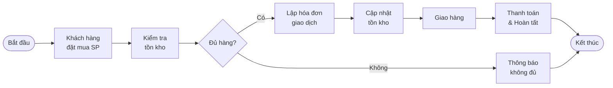
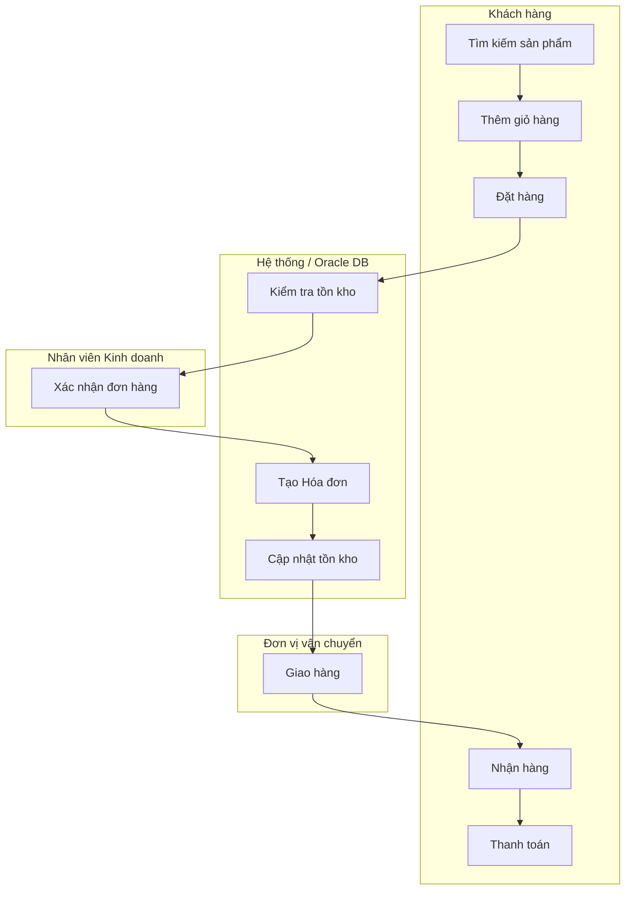

# Mermaid - Quy trình Bán hàng trực tuyến

## 1) Flowchart đơn giản

```mermaid
flowchart TD
    A([Bắt đầu]) --> B[1. Khách hàng đặt mua sản phẩm<br>• Truy cập website<br>• Tìm kiếm sản phẩm<br>• Thêm vào giỏ hàng<br>• Cung cấp thông tin giao hàng]
    B --> C{2. Kiểm tra tồn kho?}
    C -->|Đủ hàng| D[3. Lập Hóa đơn giao dịch<br>• Nhân viên xác nhận<br>• Tạo Hóa đơn<br>• Tạo Chi tiết hóa đơn]
    C -->|Không đủ| E[Thông báo<br>không đủ hàng]
    E --> F([Kết thúc])
    D --> G[4. Cập nhật tồn kho<br>• Trừ giảm số lượng tồn<br>• Đảm bảo tính nhất quán]
    G --> H[5. Giao hàng cho khách<br>• Chuyển đơn vị vận chuyển<br>• Khách nhận hàng]
    H --> I[6. Thanh toán & Hoàn tất<br>• Khách thanh toán<br>• Cập nhật "Đã thanh toán"]
    I --> F

    class A,F fill:#2E7D32,stroke:#1B5E20,stroke-width:2px,color:#fff
    class D,G,H,I fill:#E3F2FD,stroke:#1565C0,stroke-width:1px
    class E fill:#FFCCBC,stroke:#BF360C,stroke-width:1px
    class C fill:#FFF3E0,stroke:#E65100,stroke-width:2px
```

## 2) BPMN đơn giản



## 3) Swimlane theo vai trò


